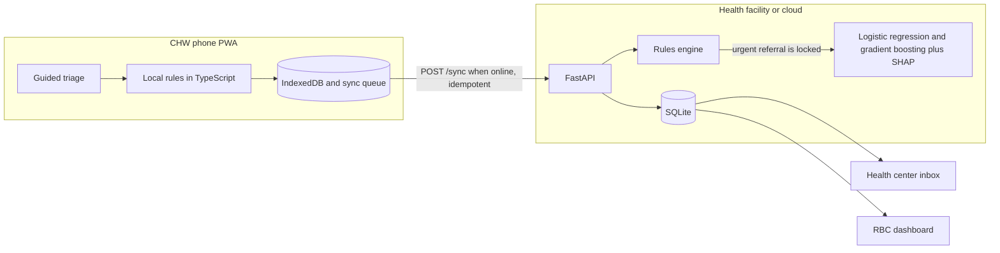
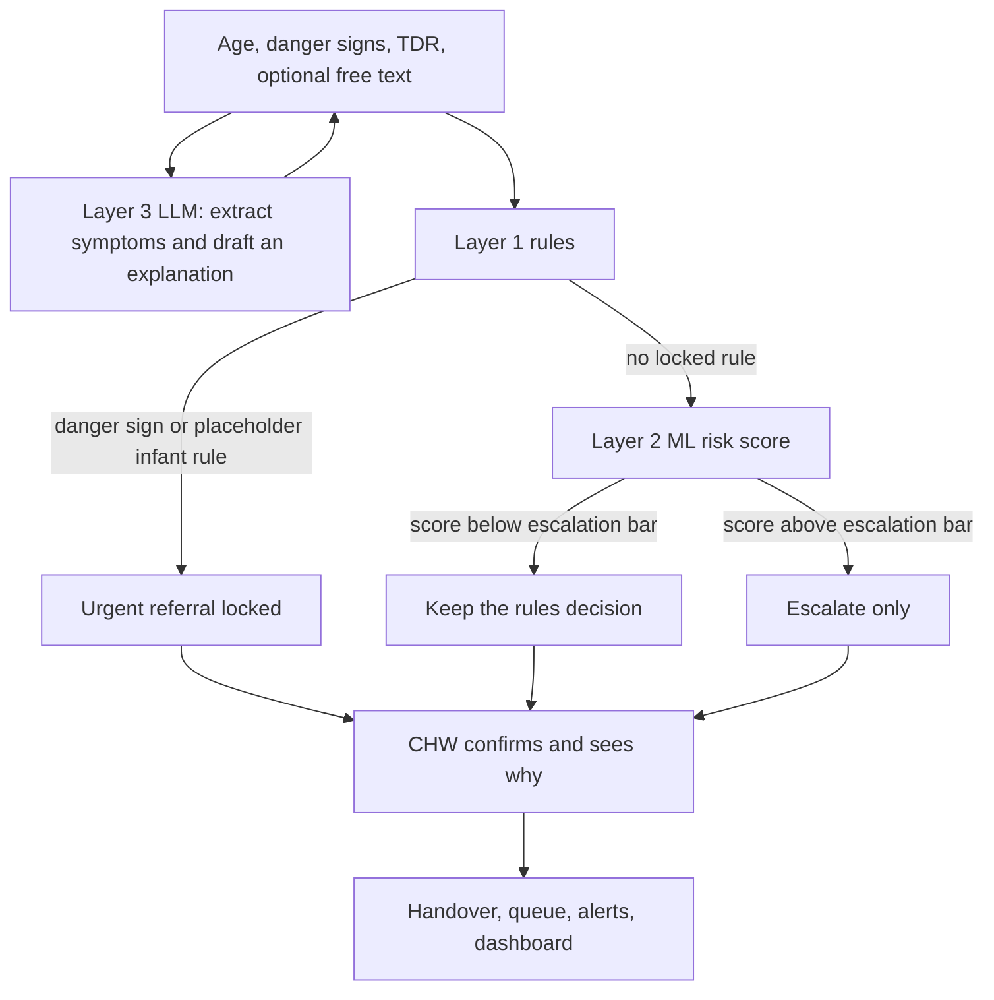

# MalariaLink

**AI for Public Good Challenge Hackathon** — University of Rwanda, UR UNIPOD  
**Sector:** Health · **Owner institution:** Rwanda Biomedical Centre (RBC)  
**Status:** Student prototype. Phases 0–8 complete for the hackathon demo.

**Decision support tool. Not a replacement for clinical judgment.**

**Synthetic demo data.** Every dataset in this repository is invented for a hackathon demo. It is not a patient registry, not a surveillance extract, and not evidence of clinical performance.

## Developer setup (Phase 9)

Copy [`.env.example`](../.env.example) to `.env` at the repo root (never commit secrets):

| Variable | Purpose |
| --- | --- |
| `ZM_JWT_SECRET` | JWT signing (8h access tokens) |
| `ZM_DEMO_MODE` | Enable `POST /auth/demo-login` (default true for hackathon) |
| `ZM_DEMO_PASSWORD` | Seeded demo user password (never hard-code in frontend) |
| `VITE_DEMO_MODE` | Show demo login buttons (apps/web `.env.development`) |
| `ZM_GEMINI_API_KEY` | Optional Gemini for Layer 3 |
| `ZM_GROQ_API_KEY` | Optional Groq fallback |
| `ZM_GOOGLE_CLOUD_PROJECT` | Optional GCP project |
| `ZM_AI_PROVIDER_ORDER` | Default `gemini,groq,local` |
| `ZM_AI_TIMEOUT_SECONDS` | Default `4` |

**Commands**

```powershell
python -m venv .venv
.\.venv\Scripts\pip install -r apps\api\requirements.txt -r ml\requirements.txt
cd apps\web; npm install; cd ..\..

.\.venv\Scripts\python ml\train.py          # optional synthetic ML artifacts
.\.venv\Scripts\python apps\api\app\seed.py # SQLite + demo users/referrals

# API
cd apps\api
..\..\.venv\Scripts\python -m uvicorn app.main:app --reload --port 8000

# Web (second terminal)
cd apps\web
npm run rules
npm run dev
```

**One-command demo (Windows):** `.\scripts\demo.ps1`  
**Makefile targets:** `install`, `train`, `seed`, `api`, `web`, `test`

**Demo accounts** (password **`demo1234`** for all; printed by `make seed` — not shown on login UI):

| Username | Role |
| --- | --- |
| `chw.demo` | CHW — mobile / web triage |
| `health.center` | HEALTH_CENTER — referrals inbox |
| `rbc.admin` | RBC_ADMIN — dashboard + admin |
| `super.admin` | SUPER_ADMIN — full access + permissions matrix |

**Related docs:** [architecture.md](architecture.md) · [voice_setup.md](voice_setup.md) · [demo_script.md](demo_script.md) · [demo_polish.md](demo_polish.md) · [pitch_outline.md](pitch_outline.md) · [ethics_and_safety.md](ethics_and_safety.md) · [qa_cheatsheet.md](qa_cheatsheet.md)

## One-line pitch

A safety-first, AI-assisted, offline-first, Kinyarwanda-native triage and referral tool that helps Community Health Workers (CHWs) triage malaria cases, sends a digital handover to the health center, alerts the CHW if a referred patient never arrives, and gives RBC a live view of malaria surge and stock pressure.

---

## 1. Problem

Village-level malaria triage relies on memory and paper. Danger-sign checks are not standardized, and referred patients are not tracked. Severe cases are recognized late or lost between the village and the health facility, causing preventable complications and deaths.

The failure is a broken loop, not a missing poster:

1. The danger-sign check is inconsistent from one CHW visit to the next.
2. A referral slip can leave the village and never be confirmed at the facility.
3. District and national teams see outbreaks and stockouts after the week they needed to act.

## 2. User

| Priority | User | Context | Job to be done |
| --- | --- | --- | --- |
| Primary | Community Health Worker | Volunteer, not a physician. Often an entry-level Android phone. Connectivity drops between the village and the health center. May prefer Kinyarwanda. | Walk through a standard danger-sign check, record the result, and hand the patient over without depending on memory or paper. |
| Secondary | Health center nurse | Receives many paper slips, often incomplete, during a busy clinic. | See who is coming, how urgent they are, and close the loop when the patient arrives and is treated. |
| Tertiary | RBC or district officer | Needs a picture across facilities, not a single chart. | Spot a surge and a stock crunch while there is still time to move tests, ACTs, or severe-malaria treatment supplies. |

The CHW confirms every recommendation. The tool does not send a referral the CHW has not accepted.

## 3. Current situation

- Cases are written in paper registers or held in memory.
- Danger-sign lists are not applied the same way on every visit.
- There is no closed loop that tells the CHW whether a referred patient reached the facility.
- Outbreaks and stockouts show up in reporting late, after the queue and the shelf have already failed.
- A digital tool that only works online will fail in the same villages that need it.

## 4. Data

Hackathon inputs are **synthetic data built from public clinical guideline categories**, not from cEMR feeds. Real deployments would sit next to four kinds of data, under RBC governance:

| Source | Role in a future deployment | What this prototype uses instead |
| --- | --- | --- |
| cEMR records | Facility confirmation that a referred patient arrived and was treated | Synthetic referral status and outcomes |
| Malaria protocols and clinical guidelines | The only authority for danger signs and age conventions | Placeholder iCCM danger signs in the generator, to be replaced by `rules/malaria_rules.yaml` in Phase 2 |
| Referral records | Closed-loop tracking | Synthetic `referral_completed` and `arrival_delay_hours` |
| HMIS / DHIS2, eLMIS, MIS/DHS, Malaria Atlas Project | Calibration of volume, season, and stock | Assumed relative burdens, documented as assumptions |

Generator, column dictionary, and calibration warning: [`data/README.md`](../data/README.md).

No row contains a name, phone number, national ID, or address. Identifiers look like `CASE-000001` and `CHW-BUG-01-01`.

## 5. Solution

Three modules share one offline-first architecture.

| Module | Who uses it | What it does |
| --- | --- | --- |
| CHW app | CHW, on a phone, including airplane mode | Guided one-question-per-screen triage, local decision, handover summary, referral list, "patient has not arrived" alerts |
| Health center inbox | Nurse | Referrals sorted by urgency, one tap for Received / Arrived / Treated, a clear not-arrived state |
| RBC dashboard | District or RBC officer | Cases, urgent referrals, completion, delay, alerts, a district map, a forecast band, a referral funnel, stock pressure |

### Safety: three layers

AI never overrides clinical rules.

| Layer | Role | Allowed to do | Forbidden |
| --- | --- | --- | --- |
| 1. Rules | Deterministic danger-sign check | Force **urgent referral** | Be downgraded by a model |
| 2. ML | Risk scores for severe disease and for referral non-completion | Prioritize or escalate | Downgrade a rules decision |
| 3. LLM / NLP | Read free text, fill the form, explain in plain language | Suggest structured symptoms and wording | Choose or soften the decision |

Every recommendation stores **why**: the rules that fired, and the top model factors when a model ran. The CHW confirms the final decision.

Clinical content lives in one editable file, `rules/malaria_rules.yaml` (Phase 2), with this sentence in the file:

> TO BE VALIDATED against the Rwanda national malaria treatment guidelines and WHO iCCM guidance by a clinician.

Phase 1 keeps the same placeholders inside the generator so the synthetic labels have a written rule. Those placeholders are widely known iCCM general danger signs (convulsions, unable to drink or feed, vomiting everything, lethargy or unconsciousness, severe respiratory distress) plus the common programmatic convention that sick infants under 2 months are referred. They are not a Rwanda-validated protocol. The generator does **not** invent temperature, respiratory-rate, or hemoglobin cutoffs. It does not calculate drug doses.

---

## Architecture

Planned runtime. Only the synthetic-data path exists today.





Offline path: the phone runs the same rules as the server, stores the case, and syncs later. The server re-checks rules on sync. A model on the server may raise urgency. It may not lower it.

## Data schema

Full generation logic, noise model, and calibration notes: [`data/README.md`](../data/README.md).

### `cases_synthetic.csv`

One row is one CHW encounter. Target size is at least 5,000 rows.

| Column | Type | Meaning |
| --- | --- | --- |
| `case_id` | string | Pseudonymous id, `CASE-000001` |
| `date` | date | Encounter date, ISO `YYYY-MM-DD` |
| `district` | string | District name |
| `sector` | string | Sector used as the facility catchment label |
| `chw_id` | string | Pseudonymous CHW id |
| `age_months` | int | Age in completed months |
| `sex` | string | `female` or `male` |
| `temperature_c` | float | Axillary or recorded temperature, Celsius, with measurement noise |
| `fever_days` | int | Reported fever duration, 0–7 |
| `convulsions` | 0/1 | Placeholder danger sign |
| `unable_to_drink` | 0/1 | Unable to drink or feed |
| `vomiting_everything` | 0/1 | Vomiting everything |
| `lethargy` | 0/1 | Lethargy or unconsciousness |
| `severe_breathing_difficulty` | 0/1 | Severe respiratory distress placeholder. Chest indrawing is not split out until a clinician says to |
| `tdr_result` | string | `positive`, `negative`, or `invalid` |
| `decision` | string | `treat_at_home`, `refer`, or `urgent_refer`. This is the **recorded** decision, including a small amount of protocol-deviation noise |
| `referral_completed` | 0/1 | 1 only if a referral was recorded and the patient arrived. 0 for home care and for referrals that never arrived |
| `arrival_delay_hours` | float or empty | Hours from referral to arrival. Empty when the patient was not referred or did not arrive |
| `outcome` | string | `recovered`, `complication`, `died`, or `unknown`. **Invented for pipeline tests. Never quote as a mortality rate.** |

Labels reserved for Phase 2 training, derived from these columns rather than stored as extra ground truth:

- `severe_case`: any danger-sign column is 1, or `age_months` is under the placeholder infant threshold (2 months). Do not use `decision` as this label. `decision` includes non-severe referrals and protocol misses.
- `referral_not_completed`: `decision` is `refer` or `urgent_refer`, and `referral_completed` is 0. Train that model on referred rows.

### `facilities.csv`

| Column | Type | Meaning |
| --- | --- | --- |
| `facility_id` | string | `HC-BUG-01` |
| `name` | string | Synthetic health center name from the sector |
| `district` | string | District |
| `sector` | string | Sector |
| `pilot` | 0/1 | 1 for the two configurable pilot districts |
| `remote` | 0/1 | 1 if the generator treats travel as harder. This flag is a demo assumption |
| `latitude` | float | Schematic point near a public district anchor, not an official GPS reading |
| `longitude` | float | Schematic longitude |

### `stock_synthetic.csv`

One row is one facility, one Monday-start week, one commodity.

| Column | Type | Meaning |
| --- | --- | --- |
| `facility_id` | string | Foreign key to facilities |
| `facility_name` | string | Denormalized for the demo heatmap |
| `district` | string | District |
| `week_start` | date | Monday |
| `commodity` | string | `ACT`, `RDT`, or `injectable_artesunate` |
| `unit` | string | Logistics unit name for the demo. Not a dosing instruction |
| `stock_on_hand` | int | Units on the shelf at week start, after the scripted shocks |
| `quantity_consumed` | int | Units issued that week, scaled loosely to local case volume |
| `stockout` | 0/1 | 1 when `stock_on_hand` is 0 |
| `weeks_of_cover` | float | `stock_on_hand / quantity_consumed`, capped, 0 on stockout |

Commodities are courses of ACT, RDT kits, and vials of injectable artesunate as **supply-chain counts**. The app must not turn these into milligram doses.

### Story baked into the synthetic window

The window is 1 October 2024 through 30 September 2026.

- Seasonality follows a qualitative Rwanda pattern: higher in the long rains (March–May) and the short rains (October–December), lower in the dry mid-year months. This is a shape, not a fitted transmission model.
- From 15 August 2026, Nyagatare case volume is multiplied so the dashboard has a visible surge against September 2025.
- Bugesera ACT weeks of 7, 14, 21, and 28 September 2026 are stockouts at every Bugesera facility in the file.
- Nyagatare injectable artesunate is critically low over the same late-window weeks, with stockouts at facilities marked remote.

Those three shocks are scripted so a live demo does not depend on a random seed surprise. `generation_meta.json` records the seed, counts, and shocks after each run.

## Demo script

Three minutes, in the order a judge will see. Phase 8 will copy this into `docs/demo_script.md` and add a one-click Demo Mode. Inputs below are the contract for that mode. They follow the placeholder rules in the generator.

**0:00–0:20 — Problem and user.** One sentence: paper triage, no standard danger-sign check, no way to know the patient arrived. Introduce the CHW on a phone, Kinyarwanda first, English one tap away. Point at the disclaimer: decision support, not a clinician.

**0:20–1:00 — Case A, treat at home.** New patient, online or offline.

| Field | Value |
| --- | --- |
| Age | 36 months |
| Sex | Female |
| Temperature | 38.6 °C |
| Fever | 2 days |
| Danger signs | All no |
| TDR | Positive |

Expected result: **treat at home** (green), reasons state no placeholder danger sign fired and the TDR is positive, CHW confirms. The screen must not show a drug dose.

**1:00–1:50 — Case B, urgent referral in airplane mode.** Turn the radio off before opening the case.

| Field | Value |
| --- | --- |
| Age | 28 months |
| Sex | Male |
| Temperature | 39.4 °C |
| Fever | 2 days |
| Danger signs | Convulsions = yes, others no |
| TDR | Positive |

Expected result: **urgent referral** (red). Reason list includes convulsions. Say out loud that a model is not allowed to turn this amber or green. CHW confirms. Handover summary, QR, and an SMS-ready text are generated on the phone. The sync badge shows waiting. Turn the radio on. The badge clears and the case appears for the nurse.

**1:50–2:15 — Health center.** Inbox shows Case B above routine referrals. Nurse taps Received. The CHW timeline moves from sent to received.

**2:15–2:35 — Missed arrival.** A referral seeded as sent yesterday, still not arrived, raises the CHW alert: follow up. This is the closed loop, separate from Case B.

**2:35–3:00 — RBC dashboard.** Filters on the two pilot districts. Show today's KPI strip, the Nyagatare surge against the previous year, the referral funnel where patients are lost, and the Bugesera ACT stockout plus Nyagatare artesunate pressure. The Synthetic demo data badge stays visible. End on the disclaimer and the line that metrics from this file are architecture proof, not clinical performance.

## Assumptions

These are choices made so the prototype can be built without blocking questions. They are not findings.

1. The product UI name is **ZeroMalaria** (repo name). The original working name MalariaLink remains in older pitch wording.
2. Pilot districts are **Bugesera** and **Nyagatare**. Comparison districts are Kirehe, Gisagara, Rusizi, and Gasabo as a lower-burden urban contrast. This is a demo selection, not an RBC site decision. Change `PILOT_DISTRICTS` in `data/generate_synthetic.py`.
3. The synthetic window is 1 October 2024 through 30 September 2026 so "today" in the hackathon week has a two-year history. Demo seed date: **2026-09-30**.
4. CHWs in the story assess fever across ages, with most encounters under five years. Infants under 2 months are a small share of rows and are labeled urgent by a placeholder convention.
5. Placeholder rules match widely cited iCCM general danger signs and the under-2-month community referral convention. A 3-day "still febrile and TDR negative" referral is included only as the common iCCM follow-up counseling interval, marked placeholder, not as a new severity cutoff.
6. No temperature, respiratory-rate, parasite-density, or hemoglobin threshold is used to assign `decision`.
7. A few recorded decisions disagree with the placeholder rules on purpose, so the table reflects inconsistent paper practice. The rules engine follows the YAML, not the noisy label.
8. Outcome probabilities are a mechanistic demo signal: missed danger signs and referrals that never arrive end in `complication` or `unknown` more often. They are not case-fatality estimates.
9. Facility coordinates are offsets from approximate district anchors so the Leaflet map has markers. They are not the Master Facility List.
10. Stock is a shock model tied loosely to case volume, plus the scripted September 2026 shortages. It is not eLMIS.
11. Person names are intentionally not generated.
12. Language of the product UI is Kinyarwanda by default and English second. All `rw.json` strings need native review (`apps/web/src/i18n/TODO_REVIEW_RW.md`).
13. Phone and server share `rules/malaria_rules.yaml` (Python loader + generated TypeScript).
14. Optional LLM extraction and speech-to-text stay behind flags with mock fallbacks.
15. Stack: React + Vite + TypeScript, FastAPI, SQLite, scikit-learn, SHAP.
16. Authentication is out of scope; routes act as a role switcher (CHW / nurse / RBC).
17. No dosing calculator, real SMS gateway, or non-malaria diagnosis engine beyond "refer for assessment."
18. Impact claims describe the loop the tool closes — not a percent of deaths averted from this repository.

## Setup and run

See the root [README.md](../README.md) and [PROGRESS.md](../PROGRESS.md). Short version:

```powershell
.\.venv\Scripts\python ml\train.py
.\.venv\Scripts\python apps\api\app\seed.py
# API: cd apps\api && ..\..\.venv\Scripts\python -m uvicorn app.main:app --reload --port 8000
# Web: cd apps\web && npm run dev
```

## Design system

Visual overhaul (2026) — Stripe/Linear polish with medical trust cues. Business logic unchanged.

| Token | Value |
| --- | --- |
| Font | Inter (self-hosted via `@fontsource/inter`), tabular nums for KPIs |
| Primary | `#0B3C5D` — one solid primary action per screen |
| Accent | `#14807A` — positive / brand highlights |
| Status | success `#16A34A`, warning `#D97706`, danger `#DC2626`, info `#2563EB` |
| Surfaces | app `#F6F8FB` (flat), surface `#FFFFFF`, border `#E5E9F0` |
| Dark (dashboard toggle) | app `#0B1220`, surface `#111A2B`, border `#1F2A44` |
| Radius | cards 12px, controls 10px |
| Icons | `lucide-react` stroke 1.75 |

Reusable UI lives in `apps/web/src/components/ui`. CHW shell is mobile-first (max 480px) with bottom tabs; facility/RBC use a desktop sidebar shell. Demo Mode is in the Presenter menu (clapperboard) in the top bar.

### Screenshots

Captured at 390×844 (mobile) and 1440×900 (desktop) into [`docs/screenshots/`](screenshots/):

| Route | Mobile | Desktop |
| --- | --- | --- |
| Language | [language-mobile.png](screenshots/language-mobile.png) | [language-desktop.png](screenshots/language-desktop.png) |
| Home | [home-mobile.png](screenshots/home-mobile.png) | [home-desktop.png](screenshots/home-desktop.png) |
| Triage | [triage-mobile.png](screenshots/triage-mobile.png) | [triage-desktop.png](screenshots/triage-desktop.png) |
| Referrals | [referrals-mobile.png](screenshots/referrals-mobile.png) | [referrals-desktop.png](screenshots/referrals-desktop.png) |
| Alerts | [alerts-mobile.png](screenshots/alerts-mobile.png) | [alerts-desktop.png](screenshots/alerts-desktop.png) |
| Facility | [facility-mobile.png](screenshots/facility-mobile.png) | [facility-desktop.png](screenshots/facility-desktop.png) |
| RBC | [rbc-mobile.png](screenshots/rbc-mobile.png) | [rbc-desktop.png](screenshots/rbc-desktop.png) |

Regenerate: `cd apps/web && npm run build && npm run preview -- --port 4173` then `node scripts/screenshots.mjs`.

## Repository layout

```text
README.md / PROGRESS.md
docs/          plan, architecture, demo script, pitch, ethics
data/          synthetic generator + CSVs
rules/         malaria_rules.yaml (single clinical source)
ml/            train.py, metrics.json, artifacts/
apps/api/      FastAPI + engine + tests + seed
apps/web/      CHW PWA, facility inbox, RBC dashboard
```

## Roadmap

| Phase | Scope | State |
| --- | --- | --- |
| 0 | Plan, architecture, schema, demo script, assumptions | Done |
| 1 | Synthetic cases, facilities, stock | Done |
| 2 | YAML rules, models, SHAP, decision layer tests | Done |
| 3 | FastAPI, SQLite, sync, pytest | Done |
| 4 | CHW offline PWA | Done |
| 5 | Health center inbox | Done |
| 6 | RBC dashboard | Done |
| 7 | Visual system, motion, demo mode, i18n | Done |
| 8 | Demo script, pitch, ethics, architecture docs | Done |
